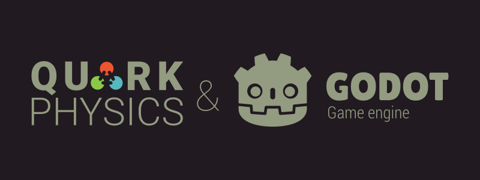

The godot-quarkphysics project is a native plugin that integrates QuarkPhysics into Godot Engine versions 4.3 and above.
QuarkPhysics is a physics engine for 2D games, capable of simulating Rigid Body, Soft Body, and various dynamics. You can find detailed information on the [project page](https://github.com/erayzesen/QuarkPhysics).

Note: This project is currently in the alpha stage. You can test it and contribute by reporting bugs.

## Features of the Extension:

* Covers the entire API of the physics engine and can be easily used with the engine's up-to-date [documentation](https://erayzesen.github.io/QuarkPhysics/documentation/).
* Can render QMeshNode objects with various advanced settings.
* Includes tools for editing QMeshNode objects.
* Supports all platforms provided by Godot's GDExtension.
* Includes example projects created with QuarkPhysics.

## How to Use? 

Until a stable release is published, no precompiled builds or initial releases are available. You can fork the project and compile it using Godot's official GDExtension compilation tutorials. The builds are placed in the `/project/addons/quarkphysics/bin` directory. You can copy the `addons` folder under the `project` directory to your project and start using it. Alternatively, you can check out the example Godot project available in the `/project` directory of this repository.

