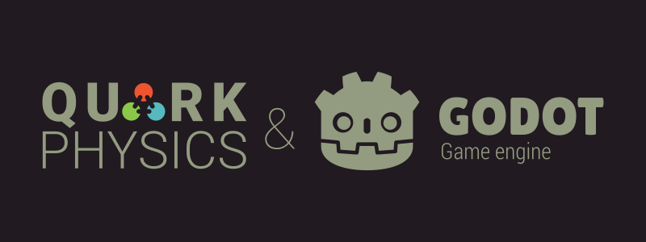
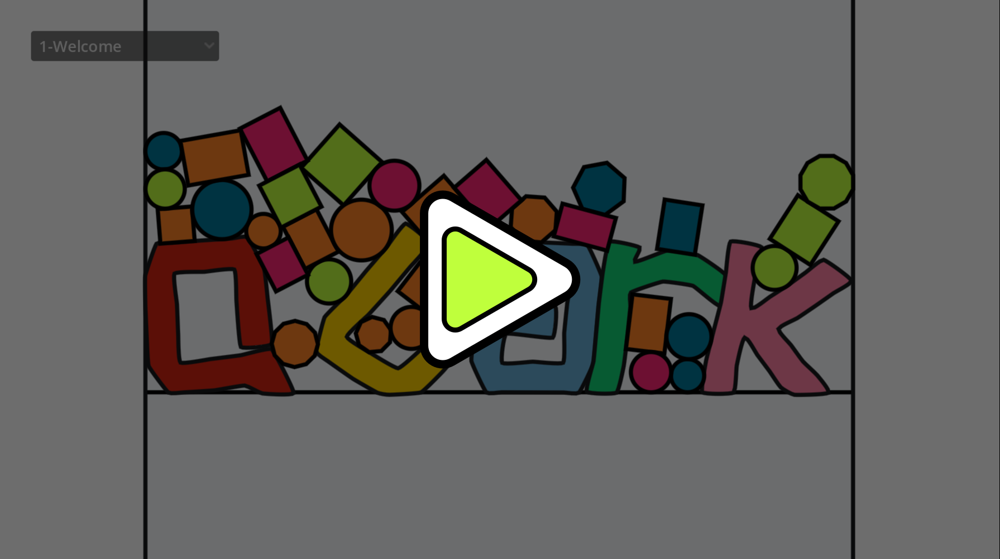

The project is a native plugin that integrates QuarkPhysics into Godot Engine versions 4.3 and above.
QuarkPhysics is a physics engine for 2D games, capable of simulating Rigid Body, Soft Body, and various dynamics. You can find detailed information on the [QuarkPhysics project page](https://github.com/erayzesen/QuarkPhysics).

[Try Example Scenes on the Web](https://erayzesen.github.io/godot-quarkphysics-web-examples/)

## Features of the Extension:

* Covers the entire API of the physics engine and can be easily used with the engine's up-to-date [documentation](https://erayzesen.github.io/QuarkPhysics/documentation/).
* Can render QMeshNode objects with various advanced settings.
* Includes `QMeshEditor` plugin for editing `QMeshAdvancedNode` objects.
* Supports all platforms provided by Godot's GDExtension.
* Includes example projects created with QuarkPhysics.

## How to Use? 
- If you'd like to take a quick look at the project, download the latest version's zip file from the Releases section. Open the project inside the zip with Godot 4.3 or a later version and explore the examples.

- If you decide to use the plugin, simply add the `addons` folder from the zip file to your project. The addons folder contains three essential components:

  * A GDExtension application located under the `addons/bin` folder, which connects the physics engine and API with Godot and includes precompiled binaries for all platforms (this is the most crucial part).
  * An EditorPlugin written in GDScript that allows you to edit QMeshAdvancedNode objects. You can activate or deactivate this plugin from the Godot settings. We recommend activating it via the `Project Settings > Plugins` settings for optimal use. However, even if the plugin is deactivated, your project will still work—it’s just an optional editor plugin.
  * The `helper_nodes` folder includes GDScript-based node objects designed to assist you with some additional tools in Godot, which you can easily modify to suit your needs. For example, one of these is a node called QTileMapCollider. When added under a TileMapLayer node in Godot, it converts the physics colliders defined on the TileMapLayer into QuarkPhysics colliders.
  
- If you prefer using Godot's Asset Library, search for QuarkPhysics in the Asset Library and add it to your project. Although updates might experience a slight delay due to the approval process, the release on the Asset Library will be identical to the one available in the GitHub Releases section.

## Any Documentation? 
* Official 
   * [Wiki](https://github.com/erayzesen/godot-quarkphysics/wiki) ( Work in progress  )
   * [QuarkPhysics API](https://erayzesen.github.io/QuarkPhysics/documentation/)

* Communnity
  * [Your Tutorial Content Link? ](mailto:erayzesen@gmail.com)

## How to Contribute?
You can contribute to the project in many ways. At this stage, the most valuable contribution is to test the project and report any bugs you encounter. You can also share your experiences. Additionally, you can help by working on documentation, creating tutorials, or promoting the project.

If you use QuarkPhysics in one of your game projects, please don’t forget to let me know at erayzesen@gmail.com. This would be a significant contribution to the showcase we plan to present soon.

